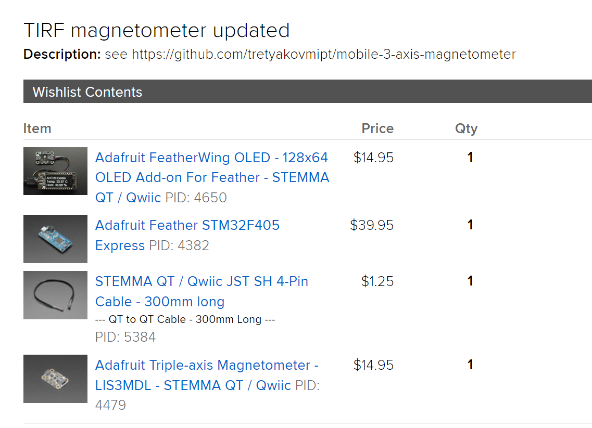
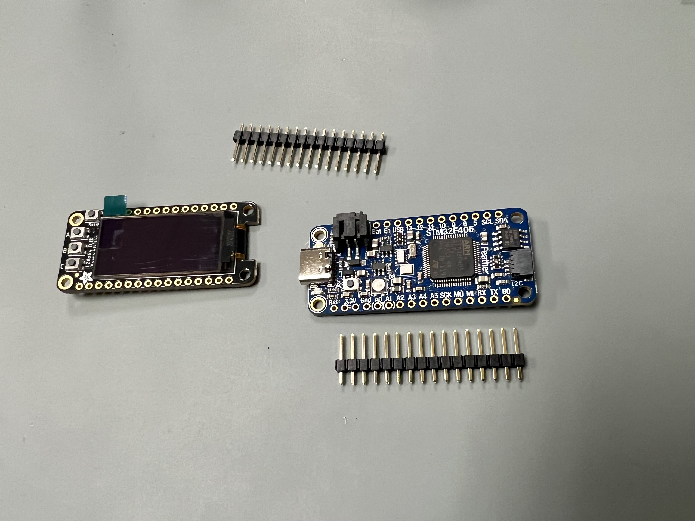
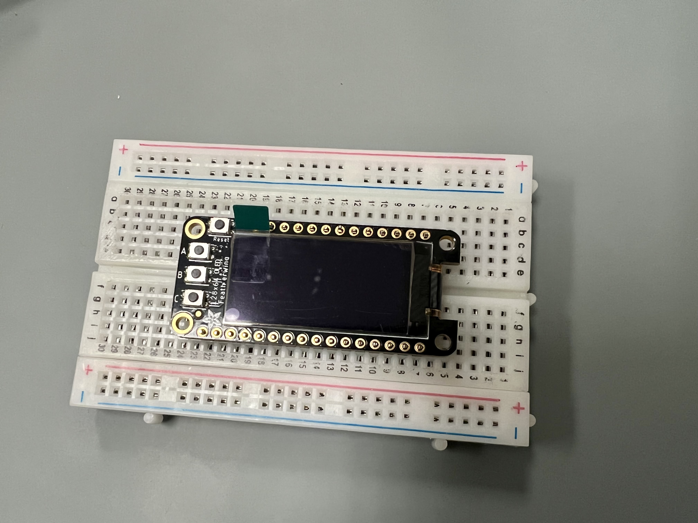
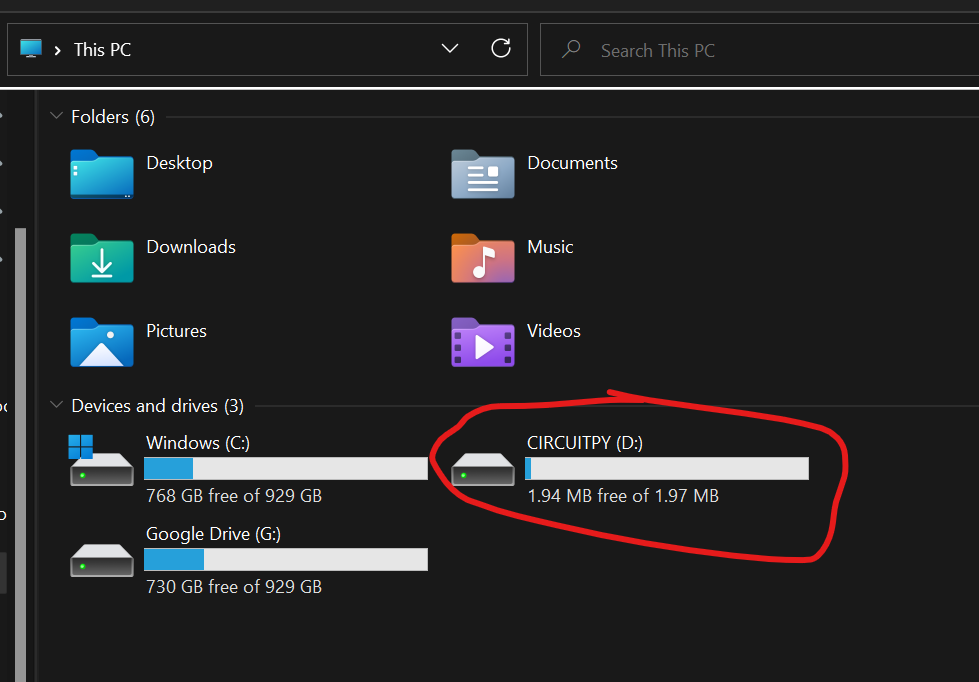
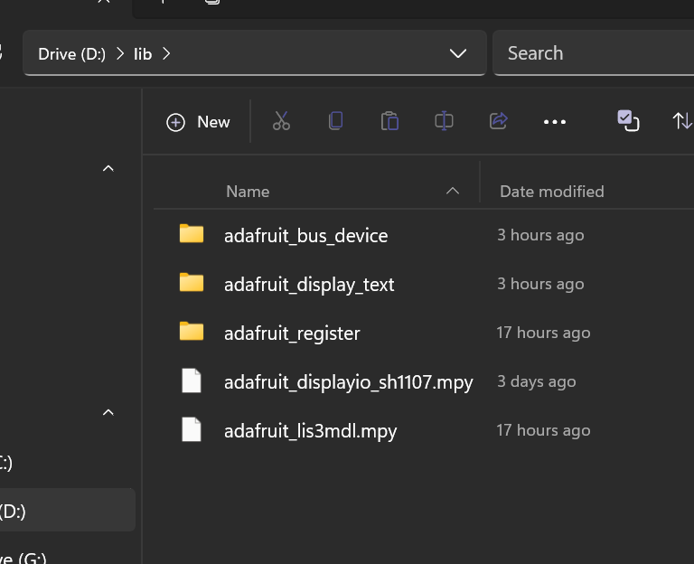
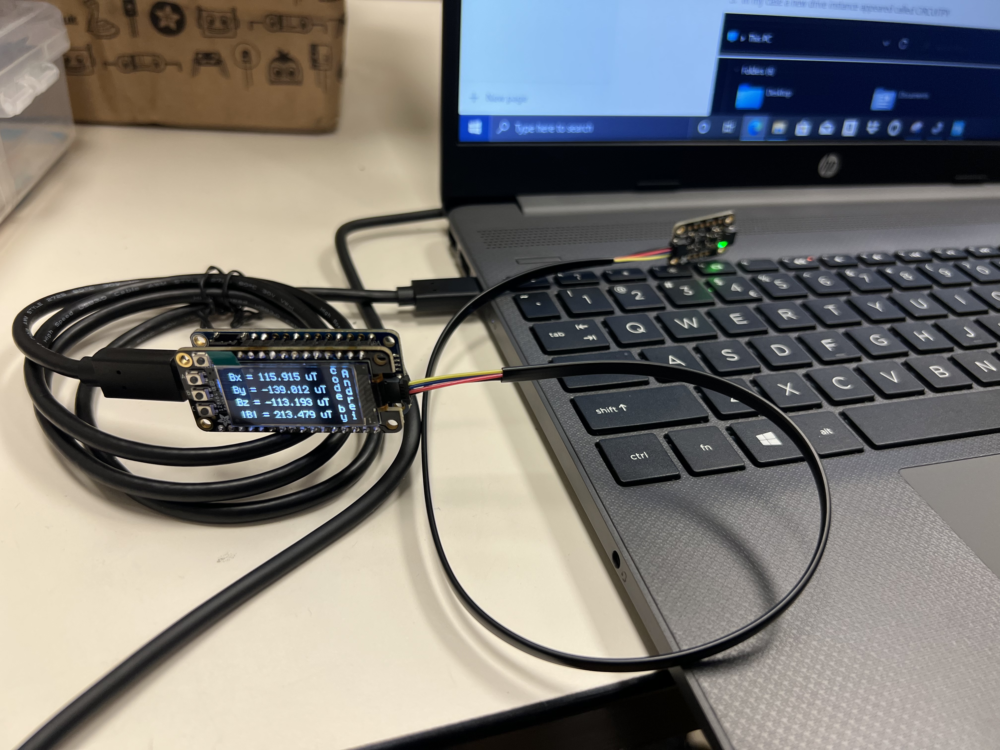

# mobile-3-axis-magnetometer
This is a setup of a general-purpose magnetometer I assembled for my postdoctoral project at UCLA. The magnetometer measures all three components of the magnetic field vector in the range of $\pm4$ gauss ( $\pm400$ uTesla) or $\pm16$ gauss ( $\pm1600$ uT).

# Parts

Here is [the list of all parts](https://www.adafruit.com/wishlists?wid=552330) from the adafruit website (you need an account to access). 


In this setup, the magnetometer is driven by a microcontroller board from adafruit, but an Arduino or a Raspberry Pi can be used instead. I used an OLED display soldered directly onto the board to display the magnetic field values, but might not be needed in the case when data is sent directly to a computer via a USB cable. Also, there might be display options that do not require soldering. 

As of October 2022, the total price of the setup is slightly above 70 USD, excluding a USB-C cable and power adapter necessary to power the device unless it’s connected to a computer. The magnetometer can become truly portable with a rechargeable [battery](https://www.adafruit.com/product/1578), which is charged when the board is connected to a power source via USB. 

# Setup

1. I prefer to start with soldering the OLED display onto the board first, but it can be done after installing the board software. For some soldering tips see [https://learn.adafruit.com/adafruit-128x64-oled-featherwing/assembly](https://learn.adafruit.com/adafruit-128x64-oled-featherwing/assembly) . It is easier to start by soldering the pins to the display.





1. Install the board firmware as described in [https://learn.adafruit.com/adafruit-stm32f405-feather-express/dfu-bootloader-details](https://learn.adafruit.com/adafruit-stm32f405-feather-express/dfu-bootloader-details) . I would do it in the following order:
    1. Download and install ****STM32CubeProg**** on your computer (if Windows OS)
    2. Download the board firmware
    3. Connect the magnetometer via stemma cable to the board, and connect the board to the PC via USB-C cable
    4. Enable DFU bootloader mode by shorting the pins. I used slim alligator clips for that.
    5. Install the firmware by following STMCube instructions from the link above. A new drive should appear on your PC.
        
        
        

        
2. Download a software bundle corresponding to your firmware version from [https://circuitpython.org/libraries](https://circuitpython.org/libraries) .
3. Move the following files to the **lib** folder



Note that the above files might be specific to particular display and magnetometer models. For more information see [https://learn.adafruit.com/adafruit-128x64-oled-featherwing/circuitpython](https://learn.adafruit.com/adafruit-128x64-oled-featherwing/circuitpython) and [https://learn.adafruit.com/lis3mdl-triple-axis-magnetometer/python-circuitpython](https://learn.adafruit.com/lis3mdl-triple-axis-magnetometer/python-circuitpython). This repo contains lib folder and code.py specific to my device.

1. In the main folder, open code.py with any text editor and update with the following code:

```python
import time
import board
import displayio
import terminalio
import adafruit_lis3mdl
import math

# can try import bitmap_label below for alternative
from adafruit_display_text import label
import adafruit_displayio_sh1107

displayio.release_displays()
# oled_reset = board.D9

# Use for I2C
i2c = board.I2C()
display_bus = displayio.I2CDisplay(i2c, device_address=0x3C) # connect to the display
sensor = adafruit_lis3mdl.LIS3MDL(i2c) # connect to the magnetometer
sensor.range = adafruit_lis3mdl.Range.RANGE_16_GAUSS # set the measurement range to 16 G
########################
#Set up the display

# SH1107 is vertically oriented 64x128
WIDTH = 128
HEIGHT = 64
BORDER = 2
REFRESH_TIME = 0.5

display = adafruit_displayio_sh1107.SH1107(
    display_bus, width=WIDTH, height=HEIGHT, rotation=0
)

# Make the display context
splash = displayio.Group()
display.show(splash)

# Draw a smaller inner rectangle in black
inner_bitmap = displayio.Bitmap(WIDTH - BORDER * 2, HEIGHT - BORDER * 2, 1)
inner_palette = displayio.Palette(1)
inner_palette[0] = 0x000000  # Black
inner_sprite = displayio.TileGrid(
    inner_bitmap, pixel_shader=inner_palette, x=BORDER, y=BORDER
)
splash.append(inner_sprite)

###########
# continuously measure and display the magnetic field

SAMPLE_NUM = 10

while True:
    #measure the field values and average over SAMPLE_NUM    
    mag_x, mag_y, mag_z = sensor.magnetic
    for i in range(SAMPLE_NUM-1):
        mag_x2, mag_y2, mag_z2 = sensor.magnetic
        mag_x += mag_x2
        mag_y += mag_y2
        mag_z += mag_z2
    mag_x, mag_y, mag_z = mag_x/SAMPLE_NUM, mag_y/SAMPLE_NUM, mag_z/SAMPLE_NUM
        
    #display Bx
    yb = 8
    text1 = "Bx = " + str(mag_x) + " uT"
    text_area1 = label.Label(terminalio.FONT, text=text1, scale=1, x=8, y=yb)    
    splash.append(text_area1)
    #display By
    text2 = "By = " + str(mag_y) + " uT"
    text_area2 = label.Label(terminalio.FONT, text=text2, scale=1, x=8, y=yb+15)    
    splash.append(text_area2)
    #display Bz
    text3 = "Bz = " + str(mag_z) + " uT"
    text_area3 = label.Label(terminalio.FONT, text=text3, scale=1, x=8, y=yb+30)    
    splash.append(text_area3)
    #display the magnitude of B
    text4 = "|B| = " + str(math.sqrt(mag_x**2+mag_y**2+mag_z**2))+ " uT"
    text_area4 = label.Label(terminalio.FONT, text=text4, scale=1, x=8, y=yb+45)    
    splash.append(text_area4)
 
    #refresh the display
    display.show(splash)
    time.sleep(REFRESH_TIME)
    splash = displayio.Group()
```

After you save the updated code, the display should start showing the magnetic field values.



For information on calibration, see [https://learn.adafruit.com/adafruit-sensorlab-magnetometer-calibration](https://learn.adafruit.com/adafruit-sensorlab-magnetometer-calibration) . We did not calibrate it, but a comparison with an expensive commercial hall probe showed excellent agreement.
